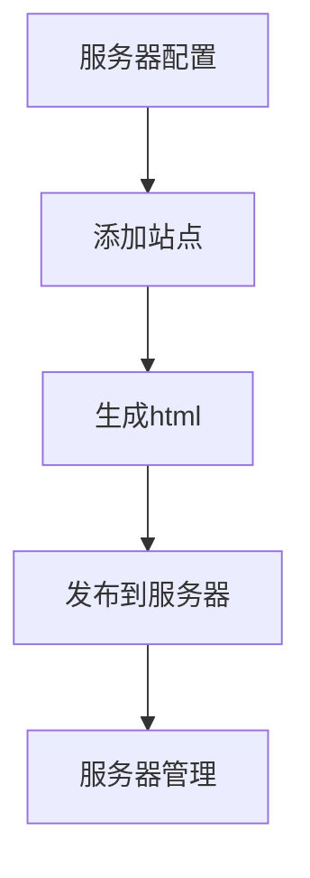

# 站群管理系统
### 功能
+ 站点管理
+ 服务器管理
+ 站点内容管理
+ 站点生成、发布

### 流程

### 服务器说明
+ 基于linux系统
+ web容器使用nginx
+ 站点内容生成全静态

### 部署说明
#### Python3.7
开发时采用Python3.7作为基础。
#### MySql 
依赖MySql数据库，所以这是必须的；
#### Celery
由于批量生成html功能运行时间长，所以采用了Celery作为后台异步运行。如果没有Celery会导致网页无法正常显示进度条。
#### Redis
Celery采用Redis作为中间件，所以Redis也是必须的。